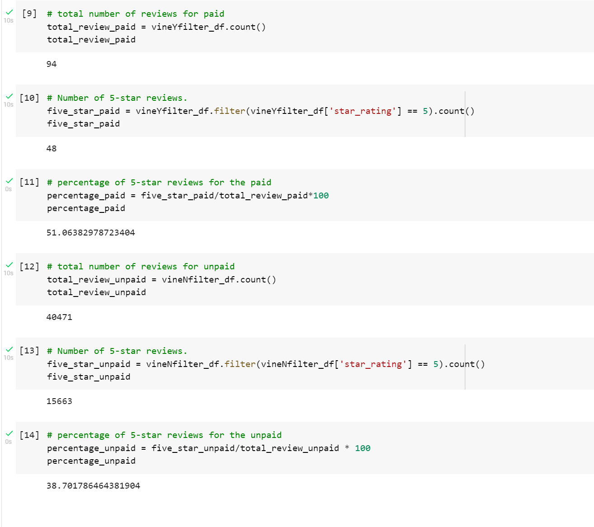

# Amazon_Vine_Analysis

## Overview
Analizing Amazon product review from buyers on video game of the Amazon Vine program, using AWS, PostgreSQL, Google Colab Notebook. 

## Result 

- Total Vine Reviews
- Total Non-Vine reviews
- Total 5-Start Vine Reviews
- Total 5-Start Non-Vine Reviews
- % of 5-Start Vine Reviews
- $ of 5-Start Non-Vine Reviews

  

## Summary
Based on the result, 51% Vine reviews vs 39% Non-Vine reviews. there's a slite positive bias for the Vine review program. 
